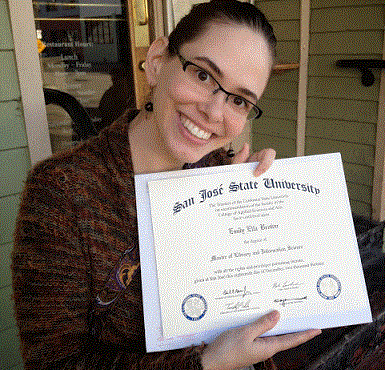

# About Me

My first name is Emily, but I prefer to go by M.

I graduated (2013) from San Jose State University Information School with a Master in Library and Information Science. I have a bachelor’s in English with a minor in History.

This is my website, where you can learn more about me, and the work I accomplished for my degree. My e-portfolio, SJSU's MLIS version of a thesis, is broken down into many parts. Enjoy exploring the site!

Organizing things brings me happiness. I pursued a MLIS degree in order to take advantage of my natural accuracy, speed and thoroughness in sorting data.

The librarian at my high school recruited me from my free class period to assist with collection management, and I enjoyed helping her run the school library all that year.

I’ve played with computers since I was a kid, and hacked a pet breeding game so that I could have the strangest virtual cats ever.

[PDF of M Brown's Resume](E_Brown_resume_2021.pdf)  in case you’re already curious.