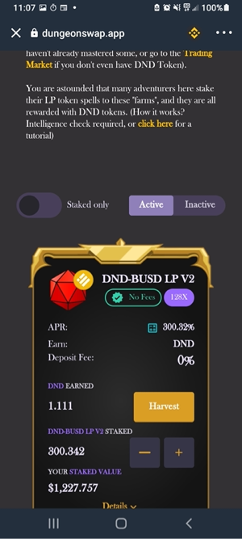
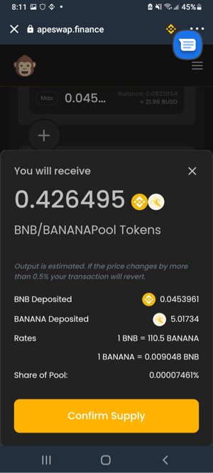
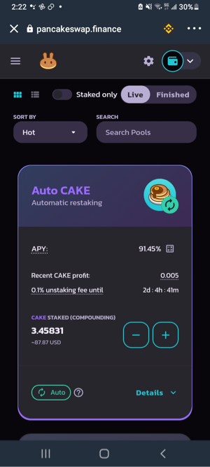
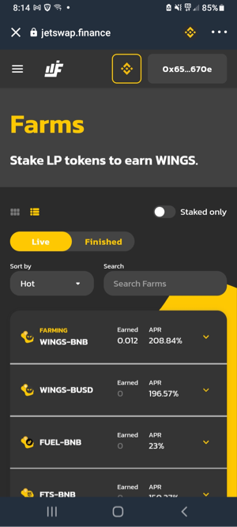

> Nothing Below is Financial Advice

🛫 Welcome to the future! The **Binance Smart Chain (BSC)** has just turned one year old, and many BSC projects are available under this new umbrella of services and websites that's being called **[Decentralised Finance](https://en.wikipedia.org/wiki/Decentralized_finance) (DeFi)**. While **Ethereum** also has their DeFi projects, current transaction fees make BSC DeFi much more viable for the small-cap financier.

> What do I mean by *financier*? Why don't I just use the term *"investor"*?

When a person puts money on chain and uses DeFi tools, they become a banker, not a bank customer-- there's no bank except for the DeFi users! The phenomenon of profit getting gobbled up by financial professionals, it's absolutely and fantastically absent here.

> You familiar with 9% APR? Why not 209% ?

# 🤔 Am I Being Facetious with Three-Digit Annual Returns?

This can't be real, you're likely thinking to yourself. Well, have no fear, it may be extremely new and delightfully unregulated but it is very, very real. The COVID-19 pandemic forced my mind into new ventures and I've learned just enough to become dangerously self-empowered by DeFi. I'm writing up posts and websites to share my findings and help redistribute wealth globally. With enough readership I'll hopefully build a tiny media empire in the process, and I'm going to teach you how to do this, too. It's all about open source software and taking your own, clear notes in your own, best way.

# 🔐 Be Careful! You Are In Charge!

When your money goes on chain, **you** have the only security keys. No power or force in this world or beyond can remove or alter your money, friend. You have become the captain of your own destiny.

# 🥰 How to Respect Your Own Awesome Power?

Write down the Twelve Words that equal your blockchain wallet, and keep this paper safe. Don't fully memorize it, or someday you'll rely on that alone and it'll fail to show up and you'll stress the heck out and go into a crazy spiral for who knows how long-- trust me, I've been there. DO NOT take a pic of it, or upload it into any software: AI spiders are already out there, crawling through accounts on the hunt for likely crypto wallet phrases (sets of 12 random words). So please, for the sake of future you, write down your Dozen Words without saving them digitally and then sit back, pat yourself on the back, and realise that you and only you are 100% responsible for your crypto money in that wallet. Rejoice!

<figure>

<figcaption align="center"><b>
The Stylish RPG-Themed Dungeonswap offers the highest yield I've seen so far
</b></figcaption>
</figure>

<figure>

<figcaption align="center">
<b>Hugely popular this summer, ApeSwap uses BANANA tokens to fill their pools </b>
</figcaption>
</figure>

<figure>

<figcaption align="center">
<b>Can't beat the bedrock sweetness of PancakeSwap where your Staked CAKE Autocompounds</b>
</figcaption>
</figure>

<figure>

<figcaption align="center">
<b>The smell of yields in the morning... Must be overpowered twin-chain terror JetSwap Finance</b>
</figcaption>
</figure>

# 🛬 What can you do with DeFi
So, to recap this idea: when you have some money on BSC, what can you do (besides send it, HODL, or speculatively trade it back and forth with stablecoin)? You can use Dexes and Swaps like [Pancakeswap](https://pancakeswap.finance), [Jetswap Finance](https://jetswap.finance), [Dungeonswap](https://dungeonswap.app), and more to stake your money for incredible returns.

# Check out this Site
I'm working on a logistical guide for anyone curious about cryptocurrency and DeFi. It's still in an early access phase, so check it out and grab some free pointers and tips!

## [Silverside Down](https://www.silversidedown.com)
