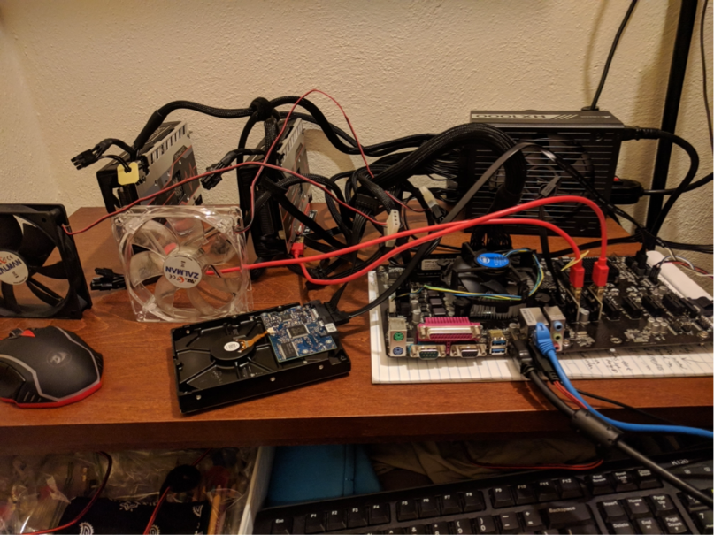
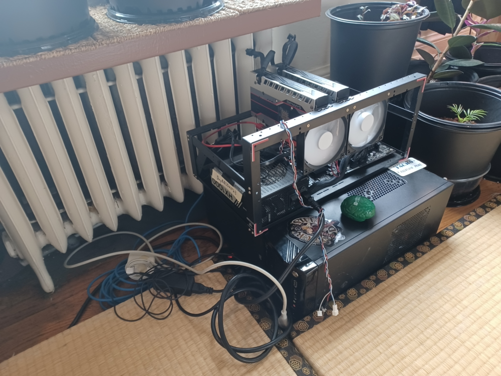
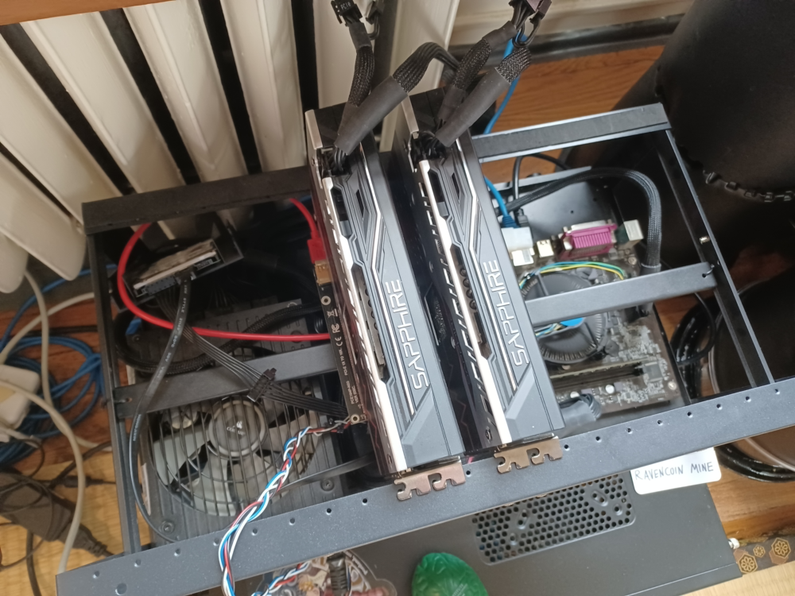

# The Mining Situation

While aware of Bitcoin for years, I didn't take enough notice of cryptocurrency until I learned about smart contracts and Ethereum in 2017. Deeply impressed that I'd glimpsed a scrap of the future, I sold old collectibles and other memorabilia to buy Ether, then ultimately decided to build a mining computer in order to generate the crypto myself.

<figure>

<figcaption align="center">
Amusingly, the small crypto mining rig didn't have a case at first (2017)
</figcaption>
</figure>

Although I built this rig to mine Ethereum, it's currently best to use it for RavenCoin. Mining RavenCoin is not difficult to set up, and it's possible on gaming PCs because it's a democratic blockchain that doesn't work any better in big mines!

<figure>

<figcaption align="center">
Current 2 GPU rig, now with case & ambient cooling
</figcaption>
</figure>

A crypto mining rig runs 24/7 and can help warm your apartment if it's in the right spot. Ancient steam radiators disperse heat passively, I'm lucky to enjoy this great synergy of old and new tech!

<figure>

<figcaption align="center">
Closer view of the 2 Polaris (AMD Sapphire) graphics cards; this motherboard can utilize up to 6 total, so there's room to grow!
</figcaption>
</figure>

The mine sends its production directly to my blockchain wallet (Trust Wallet). I receive 50 RVN each batch, which is about US$5 at time of writing. These GPUs are pretty well optimized to run quietly and cheaply while still mining well-- I did this using the vendor's own drivers, modifying settings manually.

## [Current stats of my RavenCoin Mine](https://rvn.nanopool.org/account/RDhE9ZEEcRn38x5tQiYvv9gT7MXfwL82By)